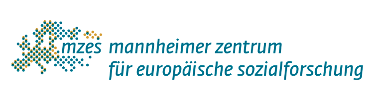

# We are the world

```r
# Why you should put this code in all of your scripts?

rm(list = ls(all=TRUE))
hello <- "world!"
```

---

# We are the children

* We are the ones who make a **brighter** day
* So let's *start* giving

$$\bar{X}=\frac{1}{n}\sum_{i=1}^nX_i$$

---

# There's a choice we're making

```{r, echo = FALSE}
library(knitr)
kable(iris[1:5, ], caption = "We're saving our own lives", format = 'html')
```

---

# It's true we'll make a better day

```{r, echo = FALSE, results = "asis", fig.height = 5}
library(ggplot2)
ggplot(data.frame(x = c(3,4,5), y = c(1,2,3)), aes(x = x, y = y)) + geom_point() + xlab("Just you") + ylab("and me.")
```

---
class: inverse, middle, center

# When you're down and out, there seems no hope at all

---
class: center



But if you just believe there's no way we can fall

---

* Well

--

* Well

--

* Well

--

* Well

---

#  let us realize

```{r, echo = FALSE, width = 40}
library(leaflet)
leaflet(width = "80%") %>% addTiles() %>% setView(8.4566, 49.4874, zoom = 20)
```

---

# Oh, that a change 

.pull-left[
- [can](https://conjugator.reverso.net/conjugation-german-verb-k%C3%B6nnen.html)
- only
- .right[come]
]

.pull-right[

]

.footnote[
[1] You know that you can press **h** for help, right?

[2] Or you can press **p**


]

???

Do you know that you have presentor notes too?

---
background-image: url(https://media1.tenor.com/images/28ee6748d1e75ed138a58dfda27a0469/tenor.gif?itemid=4855087)
background-position: center
background-size: cover
class: center, bottom

.imagelab[
When we stand together as one
]

---

# mzes_alike

Not an official product.

- `r icon::fa("twitter")` @chainsawriot 
- `r icon::fa("github")` [chainsawriot/mzes_alike](https://github.com/chainsawriot/mzes_alike)
